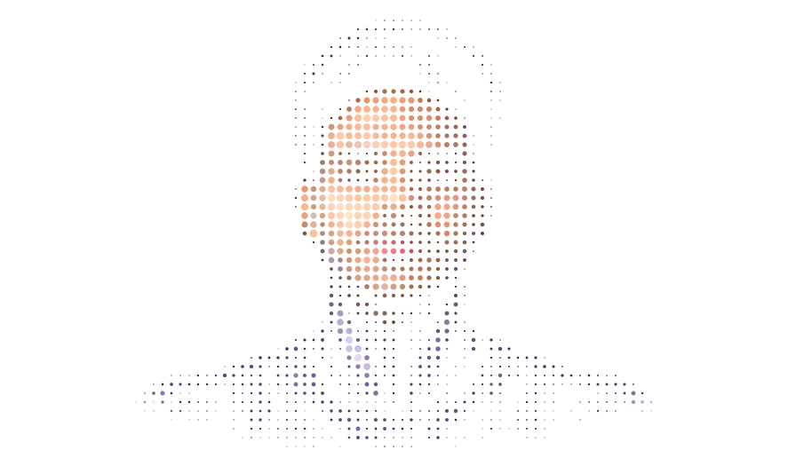
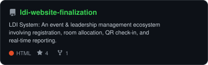
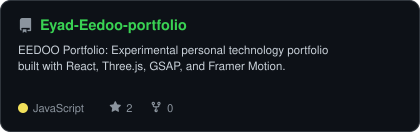
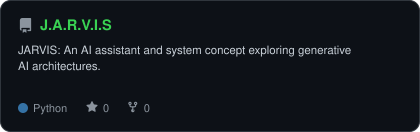
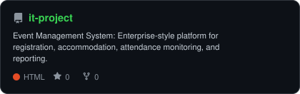
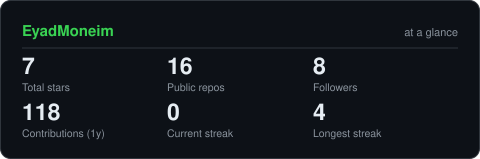

<div align="center">

# EEDOO // DIGITAL SYSTEM ONLINE

<!-- PORTRAIT - generated by scripts/dotify.py -->


<br>

<!-- TITLE / SUBTITLE - animated typing -->
<a href="https://github.com/EyadMoneim">
  
</a>

<br>

<!-- SOCIALS -->
<a href="https://github.com/EyadMoneim"></a>
<a href="https://www.linkedin.com/in/eyad-moneim-3041bb256/"></a>


</div>

---

## `~/` whoami

```console
$ ./execute-persona --identity EEDOO
```

**EEDOO** is a digital builder exploring AI, software, interfaces, and systems. Existing at the intersection of experimental design and robust engineering, EEDOO creates interactive experiences, generative AI agents, and scalable system architectures.

- Currently building **[J.A.R.V.I.S](https://github.com/EyadMoneim/J.A.R.V.I.S)** and **[LDI System](https://github.com/EyadMoneim/ldi-website-finalization)**
- Exploring **Generative AI + 3D Interactive Web Interfaces**

<br>

<div align="center">

## `~/` toolbox


<br><br>
`Frontend:` GSAP, Three.js, Framer Motion
<br>
`AI:` Gemini, OpenRouter, Agentic Workflows

</div>

---

<div align="center">

## `~/` system-status

```text
AI       █████████░
Frontend ██████████
Backend  ███████░░░
Creative █████████░
```

<br>

<table>
<tr>
<td width="50%" align="center" valign="middle">

<!-- Self-rated radar -->
<picture>
  <source media="(prefers-color-scheme: dark)"  srcset="assets/radar-dark.svg">
  <source media="(prefers-color-scheme: light)" srcset="assets/radar-light.svg">
  
</picture>

</td>
<td width="50%" align="center" valign="middle">

<!-- Live radar built from real language byte counts -->
<picture>
  <source media="(prefers-color-scheme: dark)"  srcset="assets/radar-langs-dark.svg">
  <source media="(prefers-color-scheme: light)" srcset="assets/radar-langs-light.svg">
  
</picture>

</td>
</tr>
</table>

</div>

---

<div align="center">

## `~/` selected-work

<table>
<tr>
<td width="50%">
  <a href="https://github.com/EyadMoneim/ldi-website-finalization">
    <picture>
      <source media="(prefers-color-scheme: dark)"  srcset="assets/card-ldi-website-finalization-dark.svg">
      <source media="(prefers-color-scheme: light)" srcset="assets/card-ldi-website-finalization-light.svg">
      
    </picture>
  </a>
</td>
<td width="50%">
  <a href="https://github.com/EyadMoneim/Eyad-Eedoo-portfolio">
    <picture>
      <source media="(prefers-color-scheme: dark)"  srcset="assets/card-Eyad-Eedoo-portfolio-dark.svg">
      <source media="(prefers-color-scheme: light)" srcset="assets/card-Eyad-Eedoo-portfolio-light.svg">
      
    </picture>
  </a>
</td>
</tr>
<tr>
<td width="50%">
  <a href="https://github.com/EyadMoneim/J.A.R.V.I.S">
    <picture>
      <source media="(prefers-color-scheme: dark)"  srcset="assets/card-J.A.R.V.I.S-dark.svg">
      <source media="(prefers-color-scheme: light)" srcset="assets/card-J.A.R.V.I.S-light.svg">
      
    </picture>
  </a>
</td>
<td width="50%">
  <a href="https://github.com/EyadMoneim/it-project">
    <picture>
      <source media="(prefers-color-scheme: dark)"  srcset="assets/card-it-project-dark.svg">
      <source media="(prefers-color-scheme: light)" srcset="assets/card-it-project-light.svg">
      
    </picture>
  </a>
</td>
</tr>
</table>

</div>

---

<div align="center">

## `~/` contribution-calendar

<!-- 3D isometric calendar -->


<br><br>

<!-- Snake eats the contribution graph -->
<picture>
  <source media="(prefers-color-scheme: dark)"  srcset="https://raw.githubusercontent.com/EyadMoneim/EyadMoneim/output/snake-dark.svg">
  <source media="(prefers-color-scheme: light)" srcset="https://raw.githubusercontent.com/EyadMoneim/EyadMoneim/output/snake.svg">
  
</picture>

</div>

---

<div align="center">

## `~/` github

<picture>
  <source media="(prefers-color-scheme: dark)"  srcset="assets/card-stats-dark.svg">
  <source media="(prefers-color-scheme: light)" srcset="assets/card-stats-light.svg">
  
</picture>

<br>


<br><br>


</div>

---

<div align="center">

<sub>`SYSTEM STATUS: ONLINE // EEDOO`</sub>

</div>
